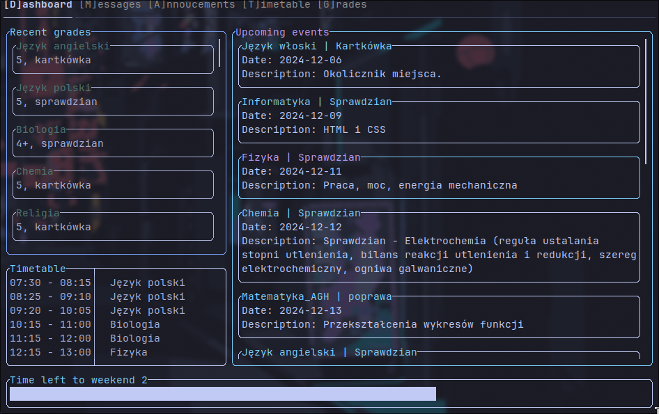
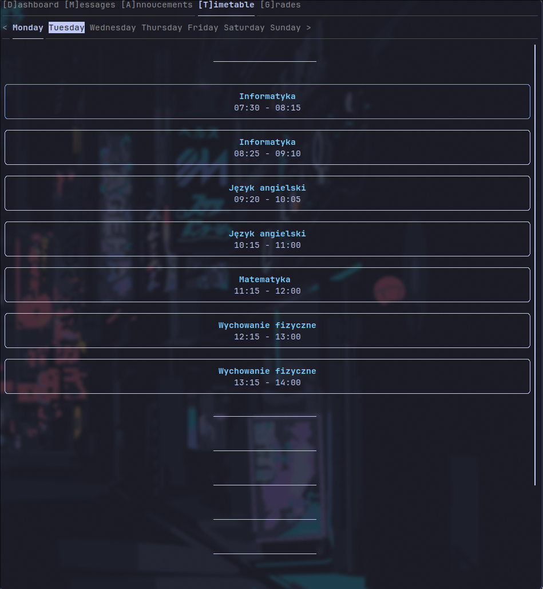
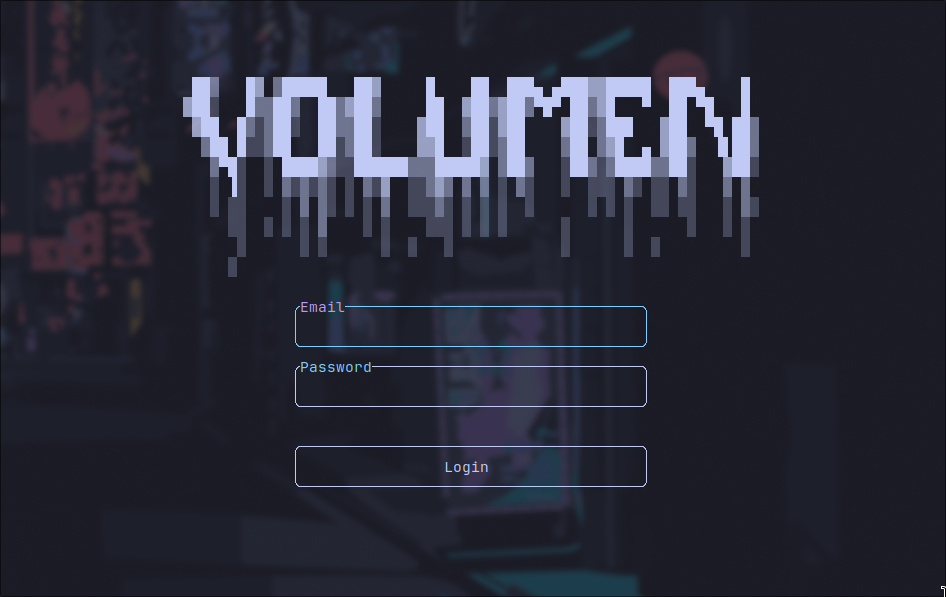

# Volumen - an unofficial tui client for librus



## Dependencies
```
keychain
ftxui
spdlog
nlohmann-json
cpr
tomlplusplus
```
All of them are automatically built by cmake.

## Build && Install
```sh
git clone https://github.com/sentientbottleofwine/volumen
cd volumen
cmake . -B build
cmake --build build/
```
To install just:
```sh
cd build/
sudo cpack
```
And then use the dedicated install format for your os. For linux for example, you would probably run the script generated by cpack or use the package if your distro is supported.
> [!NOTE]
> In case you chose the script if you want to install to the system, then I recommend using `--prefix=/usr/local` and `--exclude-subdir`
### Running the thing on windows
Due to the pain in the ass that is building on this os, an exe installer is available in the [releases](https://github.com/sentientbottleofwine/volumen/releases) page. Of course nobody stops you from building from source if you want to.

## Navigation
You can move around using h,j,k,l(or arrows), the mouse is also supported. If you're using the keyboard in the dashboard widgets will be out of focus by default(this is to ease navigation), you can press enter to focus on a widget. Also there are global keybindings to all segments of the app.



## Login
You use librus-portal credentials. After the first login the refresh token will be stored securely(using keychain), so there is no need to login again. If you want to log out tho press `n`.



## Customization 
There is also a possibility to customise the app. You can create a directory called `volumen` and a file called `volumen_config.toml`at:
On Linux:
```
~/.config/volumen/volumen_config.toml
```
On Windows:
```
%APPDATA%\volumen\volumen_config.toml
```
On Mac:
```
$HOME/Library/Preferences/volumen/volumen_config.toml
``` 
An example config can look like this:
```toml
[colors]
    main_color = "#FF0000" # Hex is supported
    accent_color1 = "#00FF00"
    accent_color2 = 5 # If you want to you can set the color from your terminal color palette(0-15)

[misc]
    # The ascii art displayed on the login screen
    splash = """
something
"""
```

## Issues
If you're having issues feel free to report them [here](https://github.com/sentientbottleofwine/volumen/issues)
